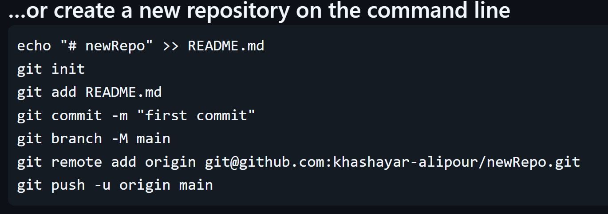
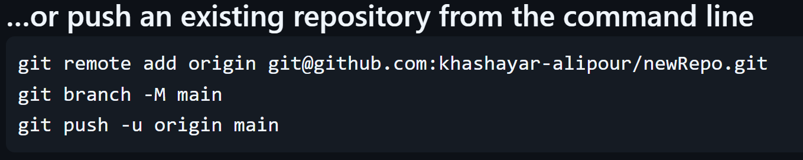
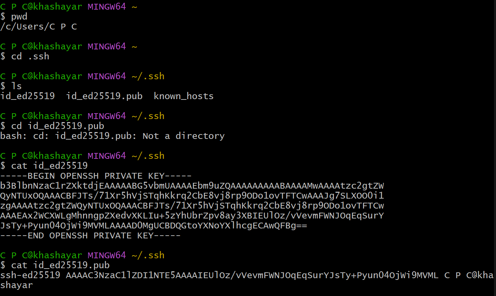
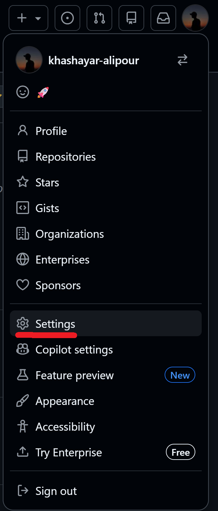
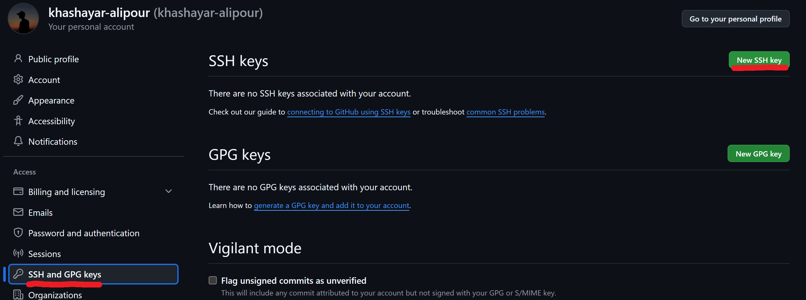
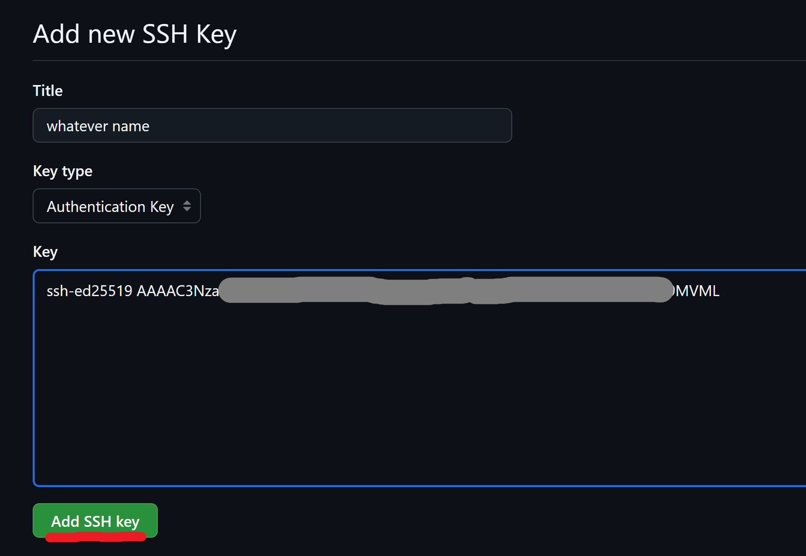
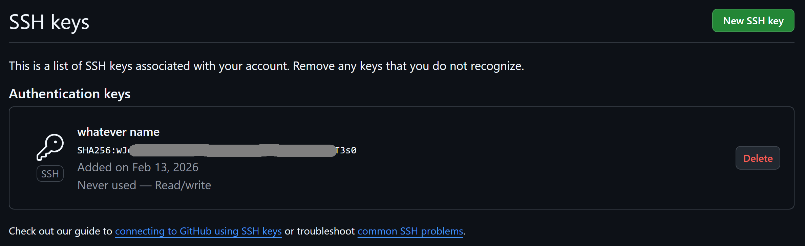
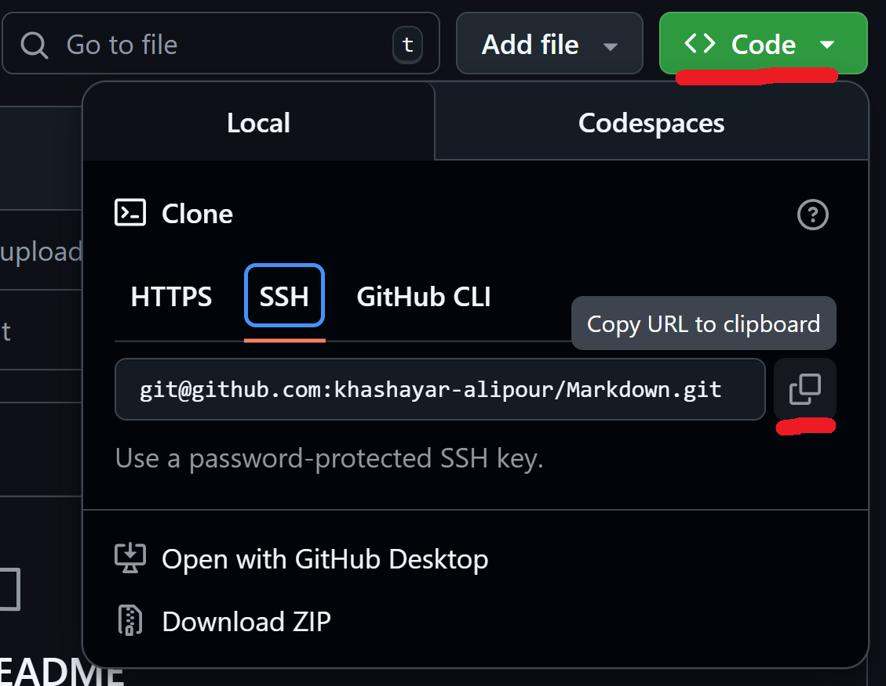

# 👽 Git-scm (source control manager)

###  ✔️ About the Project

This file gives you a quick summary for Git and Github.  
**Creator:** Khashayar Alipour
**Contact:** khashayar.alipour111@gmail.com
**License:** MIT
**Year:** 2026

#### 🐛 
**Version Control:** A system for managing changes in software files and code. It records all modifications to enable reverting to previous versions, comparing changes, and coordination between multiple developers.

**SVN (Apache Subversion):** A centralized version control system that has a central repository on a server, where users check out files and submit changes directly to the server. Unlike Git which is distributed, SVN requires server connection to access history.

**Source Control:** Synonymous with Version Control, referring to the process of storing and managing source code. This system tracks who made what changes and when in the code.

-----------------------------------------------------------------------------------

## ✨ Features

#### ==instalation==
`git --version`   →  which version is already installed?
`sudo apt update` & `sudo apt upgrade git`  →  # Ubuntu/Debian
`brew upgrade git`   →  # macOS (Homebrew)
`git update-git-for-windows`   →  updating git on windows
`git config --global user.name 'name'`   →  set user name
`git config --global user.email 'name@email.com'`   →  set user email
`git config -l`  →  read the configuration
`git --help`

#### ==path and directory==
`cd .. ` →  change directory
`cd ~` →  heading to 'Home'
`cd ~/Desktop` →  heading directly to desktop
`cat fileName` →  viewing the contains of a file
`ls` →  list
`ls -a`  →  even shows *hidden* files
`pwd` →  print working directory
`mkdir 'folder name'`  →  make a folder
`touch 'file name'`  →  make a file
`cat 'file name'`  →  read a file

#### ==diff and patch==
`git diff`
`git diff 'hash' 'hash'`
`git diff --staged`
`diff bug.py correct.py`  →  shows the difference between two files.
`diff -u bug.py correct.py`
`diff -u bug.py correct.py > patchFile.diff`
`patch bug.py < patchFile.py`

 __bug.py__ file has a bug, and patchFile contains only the corrected section of codes from __correct.py__ .  By patching the main file (__bug.py__) with the corrected section of codes from __patchFile.diff__ , the main file will be completely corrected.

#### ==workflow==
`git add 'file-name'`
`git add .` or `git add -A`  →  add all
`git rm --cached 'file-name'`   →  remove selected file from staged
`git rm --cached -r .`   →  move all the staged files to unstaged
`rm -rf 'repo name'`  →  to remove a directory
`git status` 
`git commit -m 'commit message'`
`git commit -a -m 'commit message'`  →  stage and commit __modified__ files (not newly added) in one line
`git commit --amend`  →  to change commit sentence from **last commit**, or , add a new staged file to the **last commit**
`git revert head`  →  rollback (revert) the **Head** to a **previous** commit
`git revert 'commit hash id'`  →  rollback (revert) to a **specific** commit
`git reset`  →  After running `git add`, we use this command to move the changes out of the staging area.
`git log`
`git log --graph`
`git log --oneline`
`git log --graph --oneline`
`git log -3`  →  view last 3 commits
`git show 'commit hash id'`  →  read a commit log

#### ==branch==
`git checkout main`
`git switch main`
`git branch name`
`git checkout -b name`   →  create and switch to new branch at the same time
`git branch -v`  →  `git branch` with more info
`git branch -d name`   →  to delete a branch
`git branch -D name`   →  forced deletion
`git merge -abort`   →  sole a merge conflict

#### ==files==
`git rm 'file'`  →  remove a file (staged at the same time)
`rm 'file'`  →  remove a file (without staging)
`mv 'old.py' 'new.py'`  →  rename a file using move order
`vim .gitignore`  →  whatever file name inside this file, will be ignored by git
`git chekout 'file name'`  →  undo **changes** in a modified file (*unstaged*), **before commiting**
`git restore --staged 'file name'` or `git restore 'file name'`   →  untrack a file, **before commiting**

---------------------------------

#### ==remote | origin==:
`git remote -v`  →  push and fetch URL of origin
`git remote show origin`  →  full info of the origin
`git fetch`  →  to update local repo from remote
`git merge origin/main`  →  to merge updates from remote to local repo
`git pull`  →  fetch and merge updates in one command
`git branch remote`  →  a list of all remote branches
`git merge -no-ff`  →  solve a branch conflict with no fast-forward merge

#### ==clone | SSH-Keygen==:
`git clone 'SSH-link from github repo' `
`git push`  →  for pushing changes on a private repo
`git pull`  →  for pulling changes from a private repo
`ssh-keygen`  →  make a folder for ssh key (/c/Users/pcName/.ssh/id_ed25519)
`git config --global credential.helper cache`  →  automatic login to github

On a private repo:  Generate a ssh key (private and public) using `ssh-keygen`, insert the key inside github and connect your desktop with github. From now on no password needed for cloning repos from github. After cloning, repo will be accessed throught your desktop and changes in content can be made and pushed to the remote.

